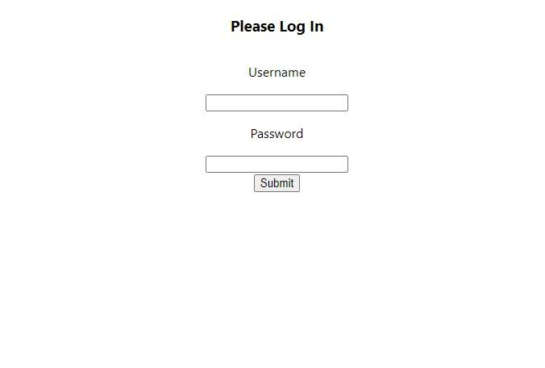
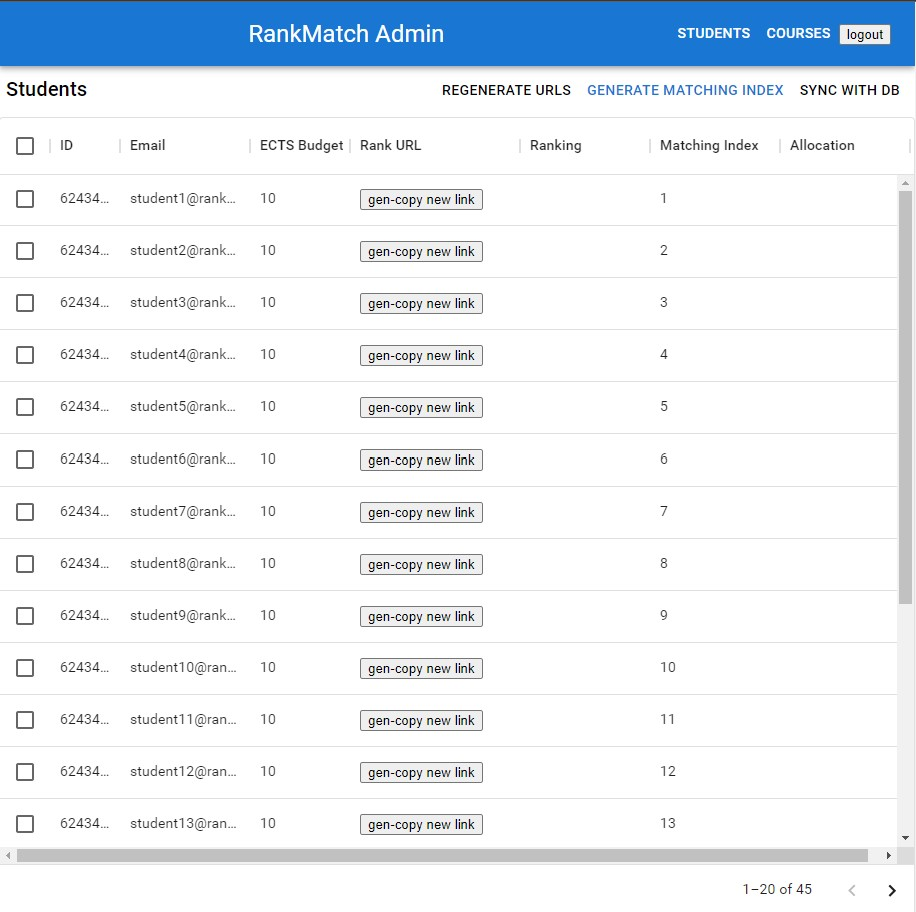
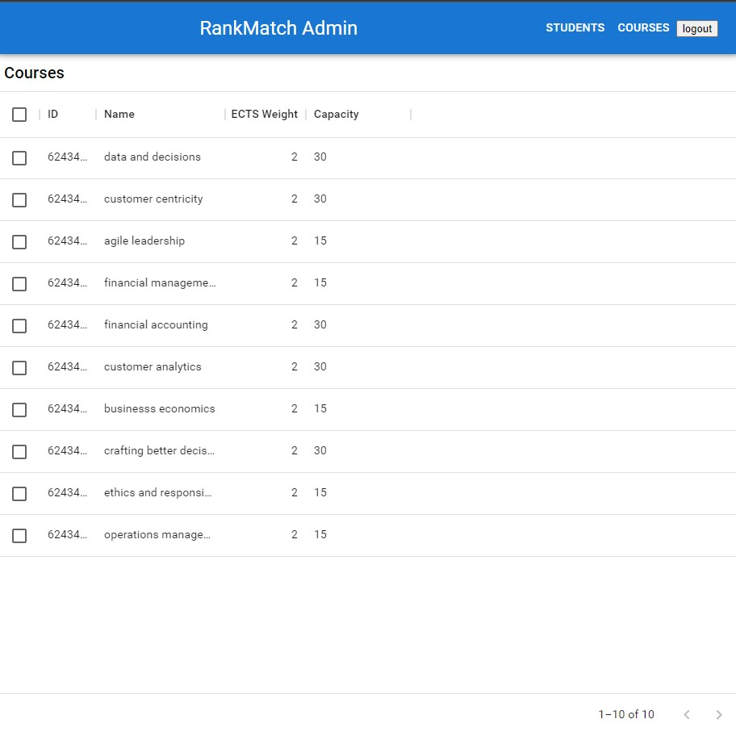
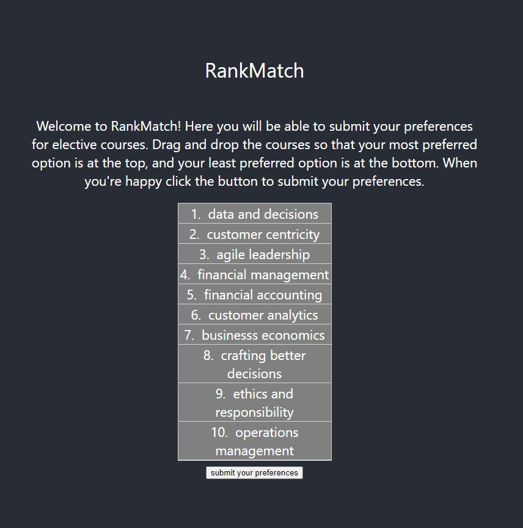
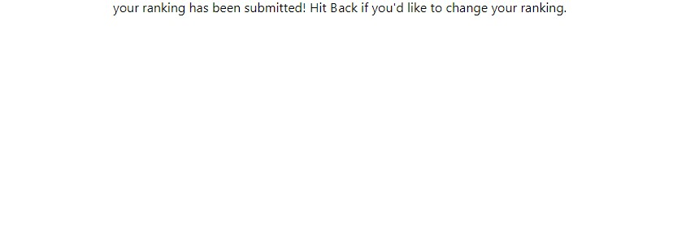
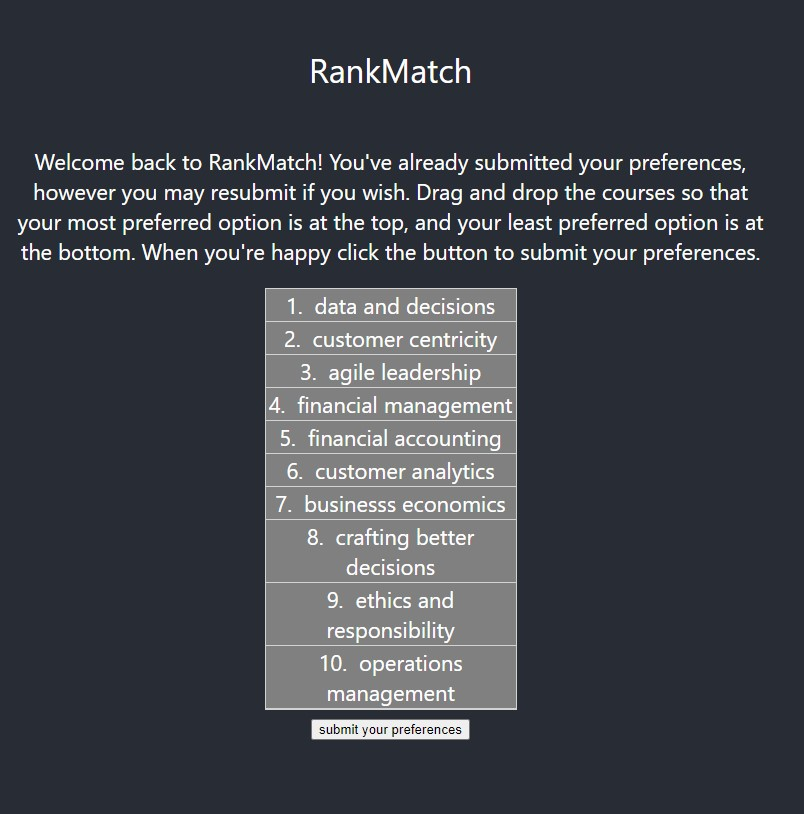

# RankMatch

## Description:

A prototype (WIP) tool to elicit student demand for elective courses with limited capacity, and then allocate them fairly. The tool allows an admin to generate tokenized individual links for students, which can be distributed via bulk email. These links provide students with a list of electives for them to rank in order from most to least preferred. The administrator can then run an algorithm to allocate students into the courses. The algorithm is due to Alvin Roth, and utilizes randomization to ensure fair outcomes.

## Table of contents:

- [Screenshots](#screenshots)
- [Demo](#demo)
- [Technologies](#technologies)
- [Installation](#installation)
- [Usage](#usage)
- [Contributing](#contributing)
- [Tests](#tests)
- [Contact](#contact)
- [License](#license)

# Screenshots

Admin Side

Login

Students tab

Courses tab

Student Side

Ranking page

Success page after submit

Ranking page revisit after successful ranking submission

# Demo

A demo of this project can be found at [rank-match.herokuapp.com](https://rank-match.herokuapp.com).

# Technologies

This app uses the following technologies:

- react
- nodejs
- graphq / apollo server
- mongodb / mongoose
- material ui
- jwt

# Installation Instructions

- Fork the repo;
- `npm i` to install dependencies;
- `npm run start` to seed data and start server;
- go into the client director and run `npm start` to start the client.

Note, admin account is created in seeding - see see server/src/seeds/adminData.json for login info.

# Usage

This tools is still under development. Manual refresh of screens is occasionally needed to ensure client data is up-to-date with server - for example, after generating an allocation, the screen must be manually refreshed in order for the allocation to appear in the client and populate the CSV download.

- After login, you will see a Students tab and a Courses tab
  - At this point, there is no functionality on the Courses tab.
- Click 'Regenerate URLs' to generate a tokenized link for each student
- Click the 'gen-copy new link' button for a given student to generate a new tokenized link just for that student.
- Click 'Generate Matching Index' and then 'Sync with DB' to randomize the order students are iterated through during the allocation procedure. (NOTE: you must click 'Sync with DB' after 'Generate Matching Index', else the random order generated will not be applied to the DB).
- After at least one student has submitted a ranking, you can try out the allocation algorithm:
  - scroll to the bottom of the Students tab
  - click generate allocation
  - refresh the screen
  - click download csv to download the data including all student fields

# Contributing

I am not seeking any contributors for this project at this stage.

# Tests

There are no tests for this project.

# Contact

If you have any questions you can reach me via:

- Github: [queenmcsteve](https://github.com/queenmcsteve)
- Email: [queen.mcsteve.666@gmail.com](mailto:queen.mcsteve.666@gmail.com)

# License

[This project is licensed under the terms of the MIT license.](https://opensource.org/licenses/MIT)
